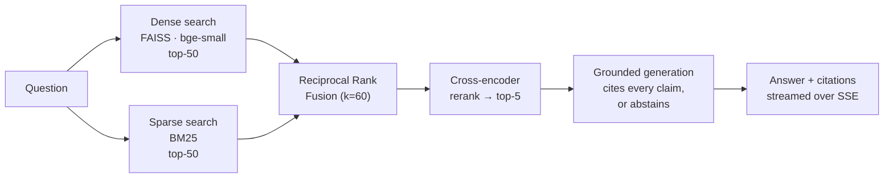
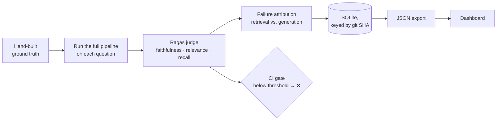

# Sentinel

> **A production RAG service with an evaluation gate in CI — and security guardrails as a second gate.**
>
> Hybrid BM25 + dense retrieval with cross-encoder reranking, served over FastAPI with SSE
> streaming, JWT auth, and rate limiting. Every pull request runs a Ragas evaluation over a
> hand-built ground-truth set; merges are **blocked when faithfulness regresses below
> threshold**. The dashboard attributes every low-scoring answer to either a retrieval failure
> or a generation failure. **Security guardrails** — prompt-injection defence, PII redaction,
> and citation validation, enforced as a second CI gate — are **in progress**.
>
> [Architecture →](docs/architecture.md) · [Eval gate →](.github/workflows/eval-gate.yml) · [Dashboard →](dashboard/) · [Judge calibration →](data/ground_truth_audit.md) · [Guardrails roadmap →](#roadmap)

---

## Why this exists

Most RAG projects stop at "it answers questions." That's the easy half. The hard half is
knowing **whether the answers are true to the sources** — and noticing when a change quietly
makes them worse.

Sentinel treats answer quality as a **tested property of the codebase**, not a vibe:

- Every answer is scored for **faithfulness** (is each claim supported by the retrieved text?),
  **answer relevance**, and **context recall**.
- The scoring runs **in CI on every pull request**. A prompt tweak, chunking change, or model
  swap that makes answers less grounded **fails the build**, the same way a broken unit test would.
- When an answer scores low, the system says **why**: the right passage was never retrieved
  (a retrieval problem), or it was retrieved and the model still got it wrong (a generation
  problem). Those need completely different fixes, and most RAG setups can't tell them apart.
- The judge that does the scoring is itself **checked against human judgment**, because an
  automated grader nobody has validated is just a number generator.

---

## How a query flows



Each stage is timed separately, so latency is reported **per stage** rather than as one blended
number that hides where the time actually goes.

## How an answer gets judged



---

## What's built

### 1 · Corpus — the IETF RFC web-protocol stack

48 current RFCs spanning HTTP (semantics, caching, HTTP/2, HTTP/3, QPACK), URIs, TLS 1.3, QUIC,
TCP, DNS, cookies, WebSocket, OAuth 2.0, JWT/JOSE, PKI, and the RFC 2119 requirement keywords —
grouped into 16 thematic clusters.

Chosen deliberately:

- **It's full of exact tokens** — RFC numbers, status codes (`429`), header names
  (`Sec-WebSocket-Key`), error codes (`invalid_grant`). That is precisely where pure semantic
  search fails, which makes it an honest test of whether hybrid retrieval earns its complexity.
- **It has unambiguous answers.** Obsoleted RFCs (e.g. 2616, 7231) are excluded so every
  question has one current authoritative source.
- **It's cleanly licensed.** The IETF Trust permits whole-RFC reproduction; Sentinel quotes
  verbatim and never produces derivative works.

The exact list, titles, and clusters are pinned in
[`data/corpus_manifest.json`](data/corpus_manifest.json); `scripts/fetch_corpus.py` downloads
them idempotently and records a SHA-256 per file.

### 2 · Ingestion — [`sentinel/ingest.py`](sentinel/ingest.py)

Load → clean (strips page footers, running headers, form feeds) → chunk (~512 tokens, ~12%
overlap) → embed locally → build a FAISS dense index **and** a BM25 sparse index over the
**same chunks with the same IDs**, so the two can be fused without misalignment. The BM25
tokenizer keeps hyphenated tokens like `Sec-WebSocket-Key` intact instead of splitting them.
Ingestion is idempotent and records the chunking strategy alongside the index.

### 3 · Hybrid retrieval — [`sentinel/retrieve.py`](sentinel/retrieve.py)

1. **Dense** — FAISS cosine search over `BAAI/bge-small-en-v1.5` embeddings.
2. **Sparse** — BM25 over the same chunks.
3. **Fusion** — explicit Reciprocal Rank Fusion merges the two ranked lists.
4. **Rerank** — a cross-encoder (`ms-marco-MiniLM-L-6-v2`) re-scores the fused pool down to the
   final top-5.

Every returned chunk carries **all four scores** (dense, sparse, fused, rerank), so you can
always inspect *why* a passage was chosen. Embeddings and reranking run **locally**, at zero
cost — no API is ever involved in retrieval.

#### Why hybrid, concretely

Ask *"What does the `invalid_grant` error mean?"* The passage in RFC 6749 that defines it is
BM25's top hit — it matches the literal token — but pure dense search buries it far down the
list, because in embedding space `invalid_grant` is just a generic "OAuth error" neighbour of
a dozen other error codes. Fusion plus reranking brings it back into the top-5. That single
query is the whole argument for hybrid retrieval, and it's covered by a test.

#### Why LangChain for retrieval orchestration

The dense and sparse retrievers are LangChain `BaseRetriever` subclasses composed with a real
`EnsembleRetriever`, because retriever composition is solved plumbing and there's no value in
rewriting it. The scored path computes RRF explicitly anyway, since `EnsembleRetriever` fuses
internally and doesn't expose the per-retriever scores that failure attribution depends on —
the framework handles orchestration; the evaluation, calibration, and tuning are the original work.

### 4 · Grounded generation — [`sentinel/generate.py`](sentinel/generate.py)

The model is instructed to answer **only** from the retrieved passages and to cite each claim
inline with the passage ID (`[rfc9110#0007]`). Two safeguards sit on top of the prompt:

- **Citations are filtered against what was actually retrieved.** A citation to an ID the model
  invented can never reach the user. (Both `[…]` and full-width `【…】` bracket styles are
  parsed — some models emit the latter, and silently dropping those made grounded answers look
  uncited.)
- **It abstains when the context is insufficient**, with a fixed sentence, rather than filling
  the gap from the model's own memory.

### 5 · The API — [`sentinel/serve.py`](sentinel/serve.py)

| Endpoint | Purpose |
|---|---|
| `GET /healthz` | Liveness |
| `POST /token` | Exchange demo credentials for a JWT |
| `POST /query` | JWT-authenticated, rate-limited, streams the answer over **Server-Sent Events** |

The `/query` stream emits a `retrieved` event (the top-5 chunks with scores), then `token`
events as the answer generates, then `done` with citations and per-stage latency. Models are
warmed at startup so the first real request isn't penalised by one-time loading. Rate limiting
is per-IP via `slowapi`; logging is structured JSON via `structlog`.

### 6 · Evaluation — [`sentinel/eval/`](sentinel/eval/)

**Ground truth.** 48 question / reference-answer / relevant-passage triples — three per
cluster — **hand-authored and verified against the actual RFC text**, never synthetic. Local
retrieval surfaces candidate passages (`scripts/build_ground_truth.py --assist`); the answers
and gold passages are written and checked by hand (`scripts/assemble_ground_truth.py`). A
second review pass is documented in [`data/ground_truth_audit.md`](data/ground_truth_audit.md).

**Scoring.** [`run_eval.py`](sentinel/eval/run_eval.py) runs the full retrieve → rerank →
generate pipeline on every question and scores it with Ragas on three metrics:

| Metric | Question it answers |
|---|---|
| **Faithfulness** | Is every claim in the answer supported by the passages it was given? |
| **Answer relevance** | Does the answer actually address the question? |
| **Context recall** | Did retrieval surface the passages needed to answer it? |

**Failure attribution.** [`attribution.py`](sentinel/eval/attribution.py) classifies each weak
result: low context recall → **retrieval failure** (the passage was never retrieved, so no
prompt could have saved it); good recall but low faithfulness or relevance → **generation
failure** (the right passage was there and the answer still went wrong).

**Built to survive free-tier APIs.** The eval scores item by item and **checkpoints every result
to SQLite keyed by git SHA**, so an interrupted run resumes instead of starting over. Retries
honour the server's own `retry-after` hint instead of guessing, connection drops are retried,
and a per-item timeout turns a hung request into a skip rather than a frozen run.

**Abstentions are scored fairly.** A correct "I don't have enough information" makes no factual
claim, so it can't be unfaithful. It's scored as faithful — while its failure to answer still
shows up as low relevance. Otherwise the gate would reward confident hallucination over honesty.

### 7 · Judge calibration

An eval gate is only as trustworthy as the judge behind it, so the judge is **checked against
human labels**: a spread of generated answers is hand-scored for faithfulness — each claim
checked against the passages that answer actually received — and correlated with the judge's
scores ([`scripts/judge_calibration.py`](scripts/judge_calibration.py)). The judge is always a
**different model from the generator**, so it never grades its own output.

Two findings from doing this properly, both documented in
[`data/ground_truth_audit.md`](data/ground_truth_audit.md):

- **Judges vary a lot.** One candidate judge showed essentially no correlation with human
  labels — it credited plausible-sounding claims that weren't in the retrieved text. The shipped
  judge tracks human judgment closely.
- **Calibration is host-specific, not just model-specific.** Serving the *identical* judge model
  from a different provider changed its faithfulness verdicts on identical inputs and weakened
  its agreement with human labels, while context recall was unaffected.
  [`scripts/compare_judge_hosts.py`](scripts/compare_judge_hosts.py) isolates this by replaying
  stored inputs through both hosts. So the judge's provider is pinned, and any swap requires
  re-calibration.

### 8 · The CI gate — [`.github/workflows/eval-gate.yml`](.github/workflows/eval-gate.yml)

On every pull request to `main`:

1. Install dependencies with `uv`.
2. Restore the indexes from cache, or build them from the committed corpus when the corpus,
   chunker, or config has changed.
3. Score **faithfulness** over a representative subset of the ground truth. Answer relevance
   and context recall are left to the full local eval: they would triple the judge's token
   spend, and the free-tier judge is capped per minute.
4. **Fail the check** if mean faithfulness is below threshold — **or** if too few items scored
   to trust the mean (a coverage floor, so a run crippled by rate limits can't pass on thin data).
5. Write a metric summary to the job summary, visible directly in the PR's checks.

The LLM key is a repository secret. The branch
`demo/prompt-regression-breaks-grounding` carries a deliberately harmful change — it loosens
the grounding prompt so the model answers from general knowledge — which passes every unit test
but erodes faithfulness. It exists to show the gate catching exactly the kind of regression
tests can't.

### 9 · Dashboard — [`dashboard/`](dashboard/)

A read-only Next.js + Tailwind app that reads exported eval JSON — no database connection, no
LLM calls.

| View | Shows |
|---|---|
| **Overview** | Headline metrics, metric trend across runs against the gate line, CI gate status |
| **Eval Runs** | Every run keyed by git SHA, expandable for attribution and coverage |
| **Drill-down** | Each question's scores; expand to see the reranked passages with all four retrieval scores, and the answer with cited passages highlighted |
| **Failure Attribution** | Retrieval vs. generation failures, with the offending questions |
| **Query Playground** | Live streaming answers from the running API |
| **Guardrails** | Roadmap only — see below |

Honesty is built into the UI: a regression never renders green, score colours can't contradict
the attribution verdict, the latency card **marks itself stale** if it was measured on a
different model than the current runs use, and the Guardrails page deliberately shows **no
metrics** because nothing is implemented behind it yet. See [`dashboard/README.md`](dashboard/README.md).

---

## Engineering decisions worth reading

A few choices that shaped the project, each made after measuring rather than assuming:

- **Ground truth built without an LLM in the loop.** Free-tier throttling made LLM-drafted
  ground truth unreliable, so it's authored from local retrieval and verified against the source
  text. The result is a reproducible artifact with no API dependency.
- **Provider-agnostic model factory** ([`sentinel/llm.py`](sentinel/llm.py)). Generation and the
  judge are configured independently by provider and model; switching is a config change. Groq,
  NVIDIA, and Google are wired. Provider choice was **benchmarked**, and the measurements are
  recorded in the module docstring.
- **Reasoning models needed taming.** The open-weight GPT-OSS models, at their default reasoning
  effort, sometimes spent their whole budget "thinking" and returned empty answers, or returned
  output the Ragas parser couldn't read. Lowering reasoning effort fixed both.
- **Coverage changes the diagnosis.** Throttled runs only scored part of the ground truth; a
  complete run surfaced retrieval failures that were invisible in the partial one. Partial
  evaluation doesn't just add noise — it can hide a whole failure class.
- **Latency measured honestly.** Per stage, never blended, with generation measured separately
  from local stages so API throttling can't inflate the retrieval numbers.

---

## Repository layout

```
Sentinel/
├── sentinel/
│   ├── config.py            # single source of truth: models, thresholds, paths
│   ├── schema.py            # Pydantic contracts shared by every stage
│   ├── ingest.py            # load → clean → chunk → embed → FAISS + BM25
│   ├── retrieve.py          # dense + sparse → RRF → cross-encoder rerank
│   ├── generate.py          # grounded, cited generation with abstention
│   ├── llm.py               # provider-agnostic chat-model factory
│   ├── serve.py             # FastAPI: JWT, rate limiting, SSE
│   ├── logging_config.py    # structured logging + per-stage timers
│   └── eval/
│       ├── run_eval.py      # Ragas pipeline, checkpointed + resumable, CI gate
│       ├── attribution.py   # retrieval- vs generation-failure classifier
│       └── store.py         # SQLite persistence + JSON export
├── data/
│   ├── corpus/              # the 48 RFCs, verbatim
│   ├── corpus_manifest.json # pinned RFC list + clusters
│   ├── ground_truth.jsonl   # hand-built eval set
│   └── ground_truth_audit.md# second-pass review + judge calibration
├── scripts/
│   ├── fetch_corpus.py              # download the corpus
│   ├── build_ground_truth.py        # surface candidate passages (--assist)
│   ├── assemble_ground_truth.py     # the hand-authored answers + gold passages
│   ├── judge_calibration.py         # correlate the judge with hand labels
│   ├── probe_judge.py               # does a candidate judge produce parseable output?
│   ├── compare_judge_hosts.py       # same judge, two providers, identical inputs
│   ├── bench_latency.py             # per-stage p50/p95/p99
│   └── export_dashboard_data.py     # cross-run history for the dashboard
├── dashboard/               # Next.js + Tailwind eval dashboard
├── tests/                   # retrieval, generation, service, eval
├── docs/                    # requirements, product design, architecture, plan
└── .github/workflows/eval-gate.yml
```

---

## Running it

**Prerequisites:** Python 3.11+ with [`uv`](https://docs.astral.sh/uv/), and a free
[Groq API key](https://console.groq.com/keys). Node 18+ only if you want the dashboard.

```bash
git clone https://github.com/krishivsaini/Sentinel.git && cd Sentinel
uv sync                                  # exact versions pinned in uv.lock
cp .env.example .env                     # set GROQ_API_KEY and SENTINEL_JWT_SECRET
```

**Build the indexes** (local, no API key needed):

```bash
uv run python -m sentinel.ingest
```

**Try retrieval on its own** — prints the top-5 with all four scores:

```bash
uv run python -m sentinel.retrieve "What does the invalid_grant error mean?"
```

**Serve the API and ask a question:**

```bash
uv run python -m sentinel.serve          # http://localhost:8000
```

```bash
TOKEN=$(curl -s -X POST localhost:8000/token \
  -d 'username=demo&password=change-me' | jq -r .access_token)

curl -N -X POST localhost:8000/query \
  -H "Authorization: Bearer $TOKEN" \
  -H 'Content-Type: application/json' \
  -d '{"question": "What does the HTTP 429 status code indicate?"}'
```

**Run the evaluation:**

```bash
uv run python -m sentinel.eval.run_eval            # full ground-truth set (resumable)
uv run python -m sentinel.eval.run_eval --ci       # the CI gate: subset + pass/fail exit code
uv run python scripts/judge_calibration.py         # judge vs. hand labels
```

**Run the tests:**

```bash
uv run pytest
```

Tests that call a live LLM are skipped by default; set `SENTINEL_RUN_LLM_TESTS=1` to include them.

**Run the dashboard:**

```bash
cd dashboard
npm install
npm run sync-data                        # pull the latest eval exports into public/data
npm run dev                              # http://localhost:3000
```

The dashboard ships with a committed data snapshot, so it renders real results even without
running an eval first.

---

## Configuration

Everything tunable lives in [`sentinel/config.py`](sentinel/config.py) and can be overridden with
`SENTINEL_*` environment variables — retrieval depth, fusion constant, rerank cut-off, gate
threshold, CI subset size, and the provider and model for each role.

| Variable | Required | Purpose |
|---|---|---|
| `GROQ_API_KEY` | yes | Generation and the Ragas judge (default provider) |
| `SENTINEL_JWT_SECRET` | yes | Signs API tokens |
| `SENTINEL_DEMO_USER` / `SENTINEL_DEMO_PASSWORD` | no | The single demo account |
| `NVIDIA_API_KEY` | no | Alternate provider |
| `GOOGLE_API_KEY` | no | Alternate provider |

Retrieval (embeddings and reranking) never needs a key.

---

## Scope and limitations

These are deliberate scope choices, stated plainly:

- **One corpus.** Everything is tuned and measured on IETF RFCs. The pipeline is generic; the
  numbers are not claimed to transfer to other domains.
- **A modest ground-truth set.** 48 hand-built items, balanced across 16 topics. Every item is
  verified by hand, which is the point — but it's smaller than a production eval set would be.
- **LLM-as-judge.** Ragas scores are produced by a model, not a person. That's why the judge is
  calibrated against hand labels and why the calibration is published rather than assumed.
- **FAISS, not a managed vector database.** A flat in-memory index is the right tool at this
  corpus size; it isn't a claim about scaling to millions of documents.
- **Free-tier friendly, not free-tier optimal.** The default setup runs at zero cost, which
  imposes rate limits. The eval is built to survive them, but a paid judge key makes CI faster
  and lets every run cover the full ground truth.
- **Single-tenant auth.** One demo account behind JWT. Multi-tenancy is out of scope.
- **No adversarial-safety layer yet** — that's the next milestone, below.

---

## Roadmap

**v2 — Security guardrails**, adding a **second CI gate** alongside faithfulness:

- **Prompt-injection defence**, measured as an injection-success rate over a labelled
  adversarial corpus. Adversarial documents are segregated from the real corpus at index-build
  time so they can never contaminate a normal eval run, and injected text is always treated as
  data, never as instructions.
- **PII detection and redaction** on outputs, with precision and recall measured on a labelled
  subset.
- **Output validation** — reject answers whose citations don't resolve to retrieved passages
  (partly in place already, via citation filtering).
- **Retrieval-scope enforcement.**

Only the injection classifier needs a model; PII detection, citation validation, and scope
enforcement are deterministic and run locally.

---

## Documentation

| Doc | Purpose |
|---|---|
| [docs/requirement.md](docs/requirement.md) | Functional + non-functional requirements, acceptance criteria |
| [docs/product_design.md](docs/product_design.md) | Product thesis, personas, surfaces, dashboard IA |
| [docs/architecture.md](docs/architecture.md) | System design, data flow, stack rationale, deployment |
| [docs/implementation_plan.md](docs/implementation_plan.md) | Phased build plan, dependency graph, risk register |
| [data/ground_truth_audit.md](data/ground_truth_audit.md) | Ground-truth review + judge calibration |
| [SENTINEL_BUILD_PLAN.md](SENTINEL_BUILD_PLAN.md) | The original build brief |

## License

MIT — see [LICENSE](LICENSE).
